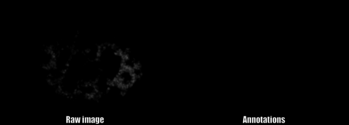

# Data description
This folder inclues all data (*t=24,34,44,54,64,74*) used in *Results* section of 3DMMS. ```.\3DMMS```, ```.\BCOMS```, ```.\RACE``` include all corresponding segmentation results from three methods. ```.\EvaluationDICE``` is used for computing *Dice ratio* in *Comparison with RACE and BCOMS* part. ```.\EvaluationOutmost``` is used for the calculating *Dice ratio* in *Segmentation of cells on the boundary*. Raw image and manual annottions are saved in ```.\RawImage``` and ```.\GorundTruth```, respectively. Complete dataset can be found [here](https://portland-my.sharepoint.com/:f:/g/personal/jfcao3-c_ad_cityu_edu_hk/EogQP1ha2H5Hm5Zly8_m92kBvHu9AWOvXb140Yj9Z_ef8A?e=4hVRlA), which provides you the all raw membrane image (t01-t95) and their segmentation results processed by 3DMMS.

One example manual annotation is shown as following:


