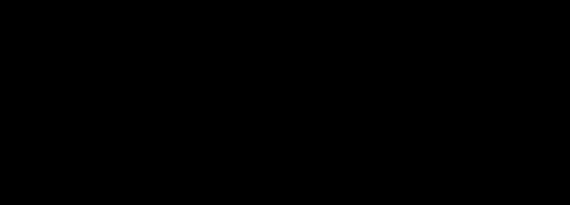

3DMMS
=================
*This repository is deprecated, pls refer to https://github.com/cao13jf/3DMMS_new*

This program implements the 3DMMS algorithm proposed in *3DMMS: Robust 3D Membrane Morphological Segmentation of C.elegans Embryo*. 

******

|Author|Jianfeng Cao, Ming-Kin Wong, Zhongying Zhao, Hong Yan|
|---|---|
|E-mail|jfcao3-c@my.cityu.edu.hk|

*****
## Usage
* **Platform dependency** 

This program is developed in Matlab 2017b. For computational efficiency, parallel computing is adopted in 3DMMS.
* **Data preparation**
  
All datasets are saved in `.\data` file. `.\data\170704plc1p2\aceNuc` includes the original file got from [AceTree](https://www.ncbi.nlm.nih.gov/pmc/articles/PMC1501046/); Download raw image data from [here](https://figshare.com/s/d932c564d5cdd7186679), and put them into `.\data\170704plc1p2\membrane`. *170704plc1p2* corresponds to the dataset name. If you want to import other data, you can use `originDataTransform.m` to assemble slices into stack images.
  
  Remember to run `startup.m` first to add all files into the working space.
  
* **Parameters settting**

If you want to analyze your own dataset, you might need to change parameters according to your own dataset. `DTWatershed.m` function includs all the parameters you need to tune. They are listed as following:

| **Parameter name** | **Meaning**                           |
|---------------:|:------------------------------------------|
|      data_name | membrane image dataset name               |
|       max_Time | maximal time point of the embryo stack    |
|       prescale | downsample ratio on each slice            |
|    reduceRatio | downsample ratio on the whole embryo      |
|  xy_resolution | resolution on each slice                  |
|   z_resolution | distance of each slices                   |

* **Segmentation**
  
Run `DWatershed.m` to implement 3DMMS segmentation on the dataset. Example results are saved in `.\results\resultsWithMerge\merged_membrane`, `.\results_analysis\interCellFeatures` and `.\results_analysis\singleCellFeatures`. The first one shows the segmentation results on every time points(max t=95); the second one includes the external features between neighboring cells as [tree](http://tinevez.github.io/matlab-tree/) structure; the last file includes the internal features on each single cell, which is also save as [tree](http://tinevez.github.io/matlab-tree/) structue.
  
`.\example_pictures` file also includes the segmentation result at t=46 for your quick reference. 
  
* **Note**

1. [ImageJ](https://fiji.sc/) can be used to view `*.tif` files.

2. [ITK-SNAP](http://www.itksnap.org/pmwiki/pmwiki.php) can be used to view `*.nii` files.

2. 3DMMS aims to segment cells in 3D, where cells closely contact to each other. Raw membrane stack images can come from *C. elegans*,  *Arabidopsis thaliana* and *Drosophila*, but not individual cells, like cells in the blood. 

## **Correspondence**
Please contact jfcao3-c@my.cityu.edu.hk

  
  
